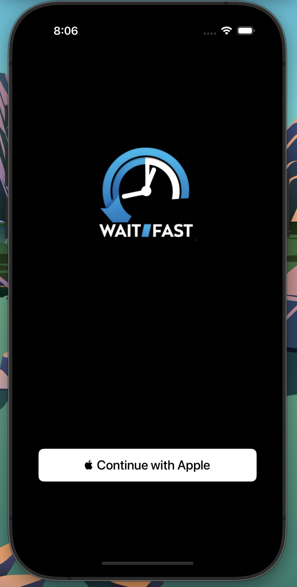
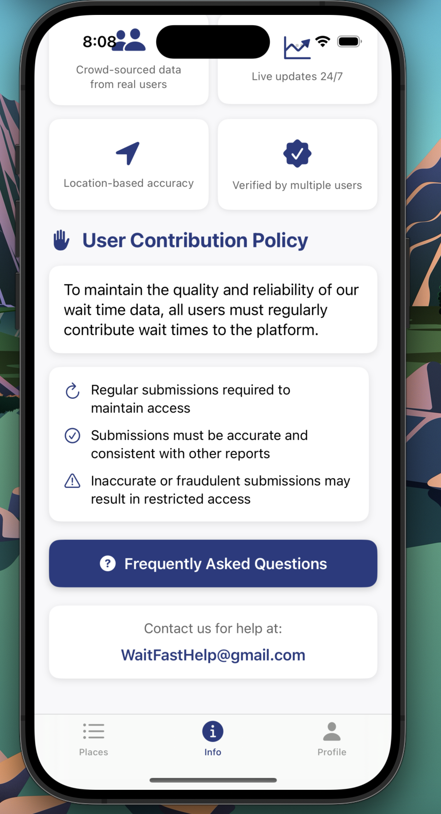
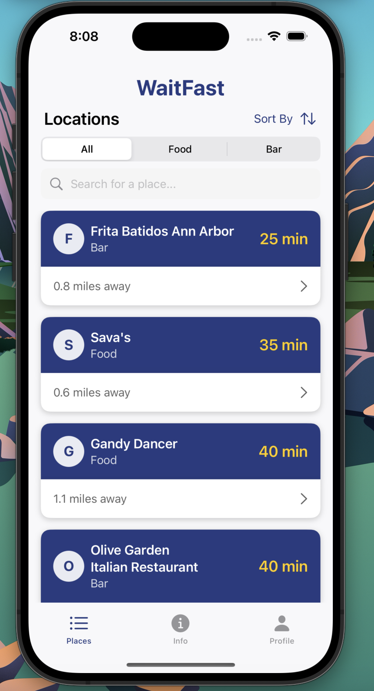
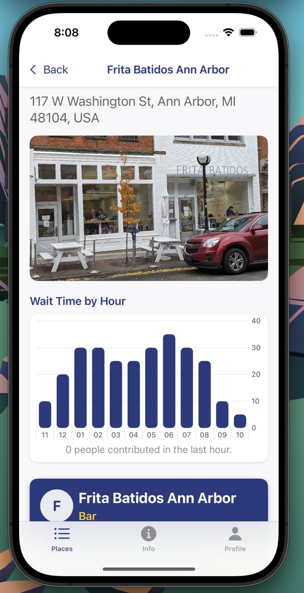
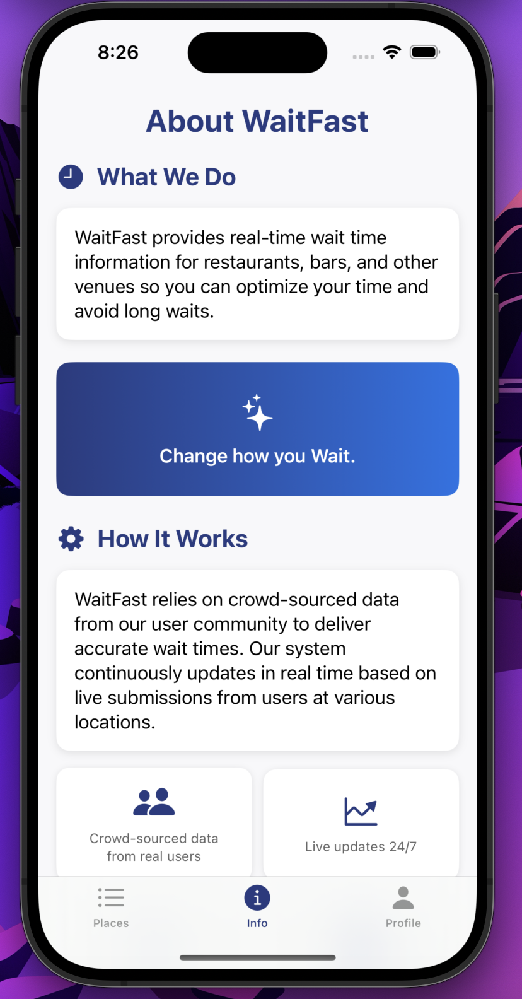

[← Back to Home](../index.html)

# WaitFast: Dynamically Updated Wait Time Application  
*January 2025 – Present*

---

## Overview

**WaitFast** is a mobile application designed to provide users with real-time, crowd-sourced wait times for restaurants and bars. The app empowers users to make informed decisions by offering accurate and dynamically updated information.

---

## Key Contributions:
- **Mobile Development:**  
  Developed using **Swift**, integrating Google and Apple location APIs for precise user and venue tracking.

- **Backend Integration:**  
  Engineered a **Flask** backend connected to a PostgreSQL database, handling live data updates through optimized **SQL** queries and dynamically formatted **JSON** payloads.

- **Data Crowdsourcing:**  
  Designed a community-driven system where users can submit and verify wait times—aggregated, validated, and surfaced through the app interface.

- **Security and Data**
  Secured backend endpoints using **AWS** Secrets Manager for credential handling and hosted the database on **AWS RDS** for scalability.
  
- **Real-Time UX:**
  Implemented logic for displaying high-confidence, crowd-validated wait estimates based on recent submissions and historical trends.

---

## Problem & Persona

Users often struggle to decide where to eat or drink due to long wait times and lack of accurate information.  
**WaitFast** addresses this by offering:
- Verified, real-time data.
- A simple interface tailored to users' immediate decision-making needs.

---

## App Frontend 

  <!-- Sliding bar using basic HTML -->
  

    
    
    
    
    
  

---

## Tech Stack:
- **Frontend:** Swift (iOS)
- **APIs:** Google Places API, Apple Maps API
- **Backend:** AWS, SQL, JSON for dynamic data updates, Python 

## Access:
- The project is currently in beta testing, and will be deployed to the appstore soon. Message me if you would like to see the beta version or request access to the repo:
[View Code on GitHub](https://github.com/TiernanJesrani/WaitFast)

---

[← Back to Home](../index.html)