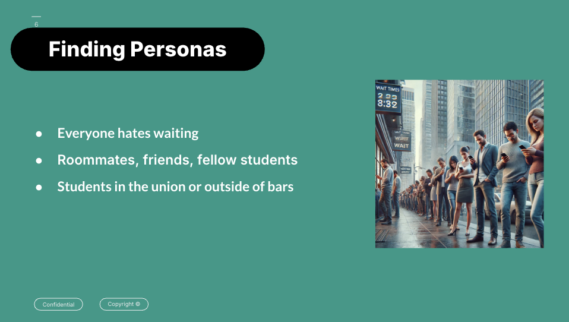
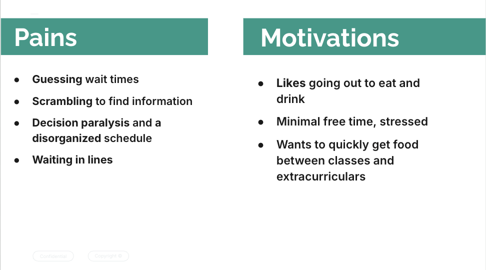

[← Back to Home](../index.html)

# WaitFast: Dynamically Updated Wait Time Application  
*January 2025 – Present*

---

## Overview

**WaitFast** is a mobile application designed to provide users with real-time, crowd-sourced wait times for restaurants and bars. The app empowers users to make informed decisions by offering accurate and dynamically updated information.

---

## Key Contributions:
- **Mobile Development:**  
  Developed using **Swift**, integrating Google and Apple location APIs for precise user and venue tracking.

- **Backend Integration:**  
  Managed **SQL queries** and dynamically updated **JSON objects** to ensure smooth data retrieval and real-time updates.

- **Data Crowdsourcing:**  
  Implemented a system for users to submit and verify wait times, providing reliable, community-driven data.

---

## Problem & Persona

Users often struggle to decide where to eat or drink due to long wait times and lack of accurate information.  
**WaitFast** addresses this by offering:
- Verified, real-time data.
- A simple interface tailored to users' immediate decision-making needs.

---

## Product Mockup & Persona Insights

  <!-- Sliding bar using basic HTML -->
  

    
    
    
    
    
    
  

---

## Tech Stack:
- **Frontend:** Swift (iOS)
- **APIs:** Google Places API, Apple Maps API
- **Backend:** SQL, JSON for dynamic data updates, Python 

## Access:
- The project is currently in beta testing, and will be deployed to the appstore soon. Message me if youd like to see the test or access to the repo
[View Code on GitHub](https://github.com/TiernanJesrani/WaitFast)

---

[← Back to Home](../index.html)